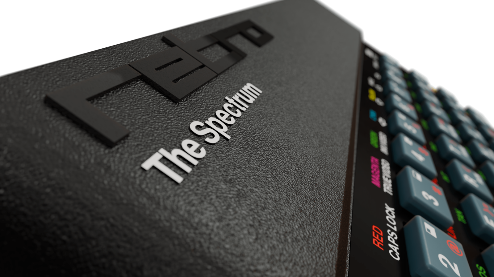

<p align="center">ZX Spectrum TOSEC Utility Script</p>

<hr/>

A shell script to convert the [TOSEC](https://archive.org/details/zx_spectrum_tosec_set_september_2023) collection of ZX Spectrum games, plus the top 200 demos, into a structure suitable for use with [The Spectrum](https://retrogames.biz/products/thespectrum/) games console.

## Prerequisites

- **Linux/macOS:** `unzip` (optionally `7z`/`7zz`, used as a fallback for archives with awkward filenames) and `curl`
- **Windows:** PowerShell (built in)
- Plenty of free disk space: `Games.zip` alone is around 1.8 GB before extraction

## Running The Script

- Clone this repo or copy the most appropriate `thespectrum-util` script for your OS
- Download the latest [Demos.zip](https://archive.org/download/zx_spectrum_tosec_set_september_2023/Demos.zip) and [Games.zip](https://archive.org/download/zx_spectrum_tosec_set_september_2023/Games.zip) from [TOSEC](https://archive.org/details/zx_spectrum_tosec_set_september_2023) into the same folder as the script. The script unzips them automatically if the `Demos/` and `Games/` folders don't already exist

> [!WARNING]
> Files are **moved**, not copied, out of the `Demos/` and `Games/` folders. Keep the original zips (or a copy of the folders) if you want to run the script again.

### Linux / macOS

#### BASH Shell:
```
chmod +x thespectrum-util.bash
./thespectrum-util.bash
```

#### Z Shell:
```
chmod +x thespectrum-util.zsh
./thespectrum-util.zsh
```

### Windows

#### PowerShell:

Run (⊞+R) `powershell.exe -ExecutionPolicy Bypass`
```
.\thespectrum-util.ps1
```

---

This will move the game files with supported extensions (tap, tzx, pzx, rom, szx, z80, sna, m3u) into a compatible folder structure under `THESPECTRUM/TOSEC-Demos` and `THESPECTRUM/TOSEC-Games`, created alongside the script.

**Games:** As The Spectrum only supports up to 256 files per folder the titles are split alphabetically (#, A...Z) and numerically (A0...A3). A bucket won't appear if none of its titles contain supported files.

**Demos:** Rather than every TOSEC demo, only the **top 200** are processed. The list in `top200-demos.txt` (one TOSEC folder name per line) is ranked by [Pouët](https://www.pouet.net/) popularity scores. Those demos are moved flat into `THESPECTRUM/TOSEC-Demos/<nnn>. <title>/`, where `nnn` is the rank (e.g. `001. Mescaline Synesthesia`), so they sort in rank order. A listed demo that isn't found in `Demos/` is skipped with a warning but still keeps its rank number.

Many TOSEC demos are TR-DOS images (`scl`, `trd`), which The Spectrum doesn't support; these are left behind in `Demos/`.

Folder and file names are made safe for the FAT32-formatted USB stick: apostrophes are dropped, other unusual characters are replaced with `_`, title folders are shortened to 64 characters and filenames to 128, and clashing names get a ` (2)`, ` (3)`... suffix. Each rename is logged as `Renamed: <old> -> <new>`.

[NOTE!] In order to increase compatibility this utility also downloads the original Spectrum ROMs from [FBZX](https://github.com/rastersoft/fbzx) into a `THESPECTRUM/roms` folder.

Copy THESPECTRUM folder to a suitable USB, plug in to [The Spectrum](https://www.youtube.com/watch?v=EnfQ13nFJYc) & enjoy!
